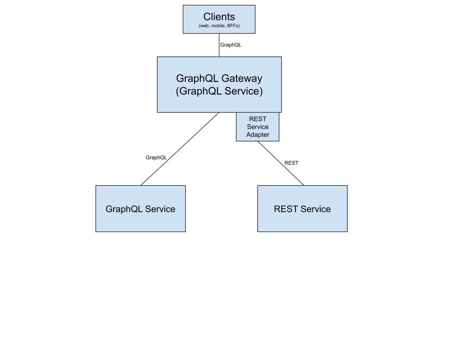

### REST Service Adapter
REST adapter is an abstraction layer that enables a Graphql service to consume data from a downstream REST service in 
pure GraphQL format.   




### Creating a new REST adapter in GraphQL Gateway
In order to expose a REST Service as a GraphQL, the following requirements must be met:

|METHOD|REQUIREMENT|
|---|---|
|GET|May or may not use path parameters<br/>Request Body is empty<br/>Response Body in JSON Format|
|PUT<br/>POST|Request Body for the REST endpoint must match the schema of the *InputObjectTypeDefinition* that will be used in the mutation's field argument|
|DELETE<br/>PATCH|Not yet supported|


1. Create a new folder inside `src/registrations/1.0.0/` in [GraphQL Gateway](https://github.com/intuit/graphql-gateway-java). 
The name of the folder should be the appId. Example `Test.appid`

2. Create a file main/config.json inside the folder created in step 1.
   The type field must be set to `rest`. 
   [Complete Json Spec](config-json-spec.md)
   
3. Create a `main/graphql/schema.graphqls` schema file inside the folder created in step 1. This file will contain
   the schema represented by the REST endpoint. If the schema and the endpoint response are different you
   cannot use REST adapter.
   
   Make sure to use the `@adapter(service: 'serviceName')` at the correct field you want to call your endpoint for.
   ```graphql
   
   type Query {
      petStore: PetStoreType
   }
   
   type PetStoreType {
      myRestField1: MyType1 @adapter(service: "myService1")
      storecart: StoreCartType
   }
  
   type StoreCartType {
      myRestField2: MyType2 @adapter(service: "myService2")
   }
   ```

4. Create a `main/flow/service.flow` adapter file inside the folder created in step 1. This file will contain 
[service definition specifications](service-definition-spec.md) to call your rest endpoint.
   
   Make sure you have a service node referring to the service argument used in the @adapter directive
   ```java
   Service service as myService1 ...
   
   Service service as myService2 ...
   ```
    The final folder after step-4 should look like this 
   ```
   {APPID}
   |-- main
       |-- config.json
       |-- graphql
           |-- schema.graphqls
       |-- flow
           |-- service.flow 
   ```        
             
5. Test the adapter locally by starting [GraphQL Gateway](https://github.com/intuit/graphql-gateway-java).

